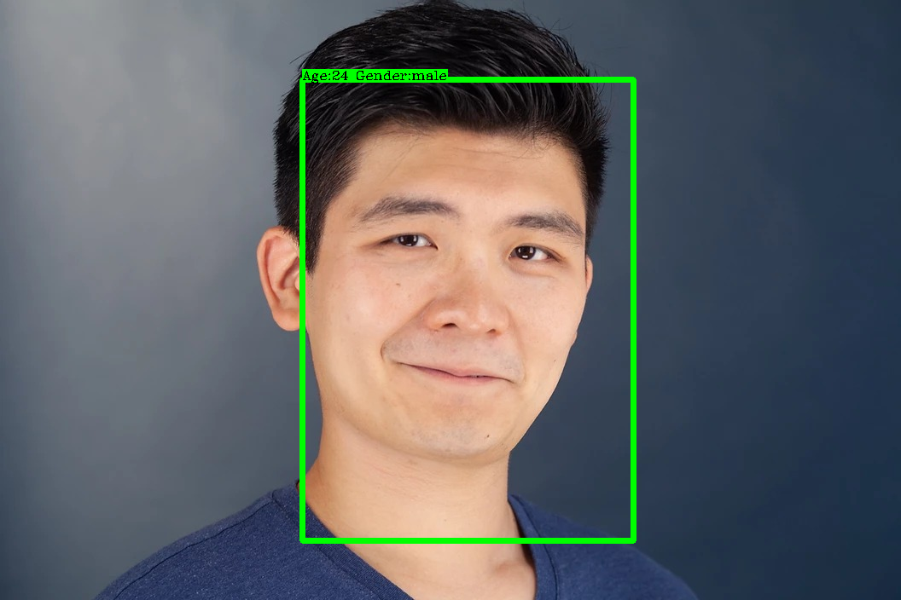
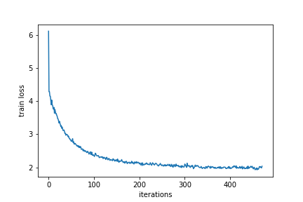
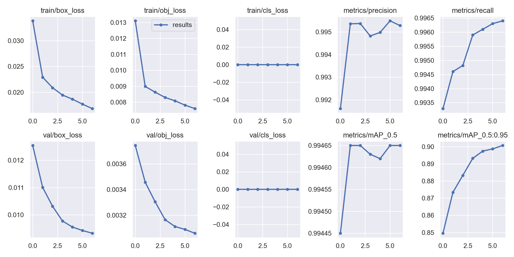
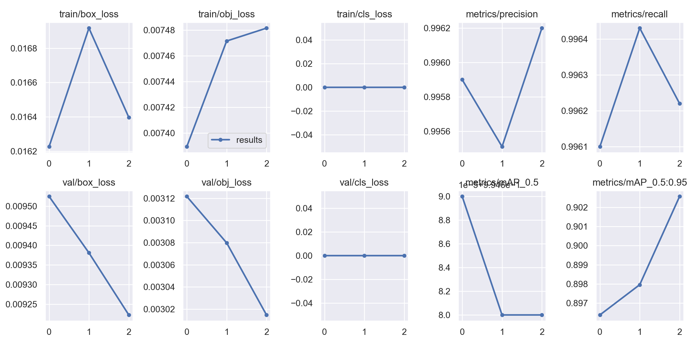

# Face-recognition-and-detection

## Usage
    1. Unzip FaceRecognition_model.rar
    2. run main.py
    3. Change the picture by changing the cv.imread()

---
## Face recognition

 

Model：Resnet50 
Dataset：AFAD 
Trainloss

---
## Face detection

 

Model：Yolov5s 
Dataset：Celeba 
Trainloss(1-7epochs)

Trainloss(8-10epochs)

